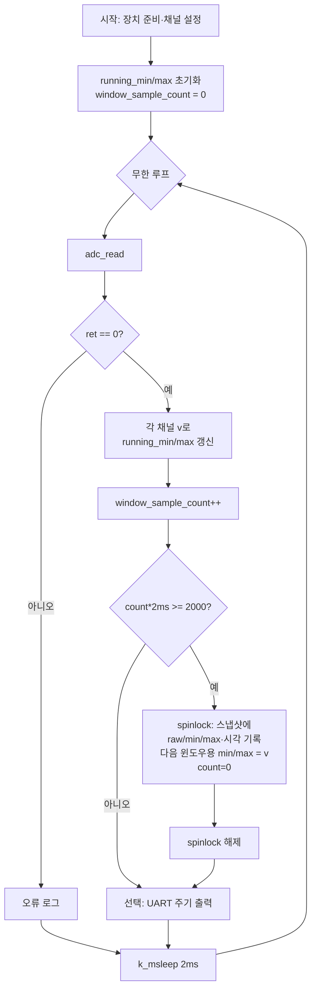
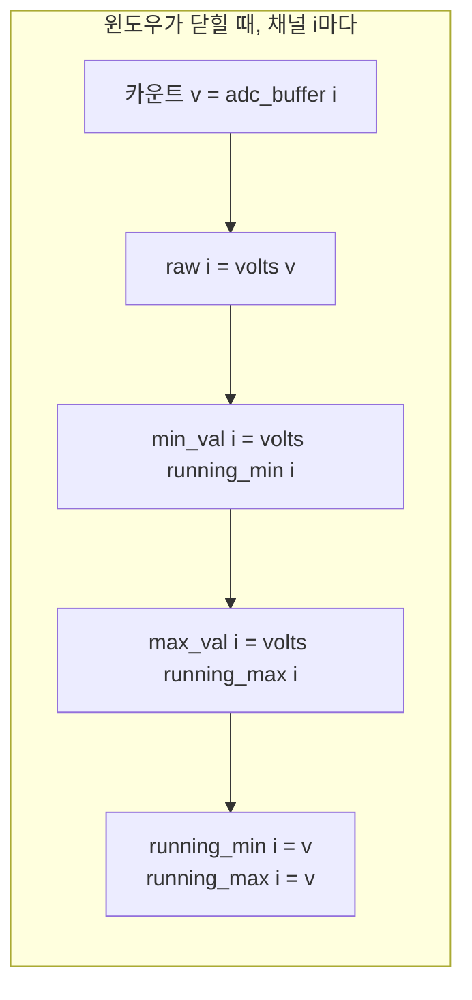

# ADC min/max 수집 알고리즘 설명

Smart Gateway 펌웨어(`src/adc.c`)에서 **고정 간격으로 ADC를 읽으면서, 최근 약 2초 구간의 채널별 최솟값·최댓값을 추적**하는 방법을 정리합니다. 별도의 샘플 링버퍼 없이 **상수 시간(O(1))** 만에 갱신합니다.

---

## 1. 목적과 결과물

| 항목 | 설명 |
|------|------|
| **입력** | LPADC 다채널 변환 결과(12비트 카운트, 채널 수는 `ADC_CHANNEL_COUNT`) |
| **출력** | 공유 구조체 `adc_snapshot_t`: 채널별 `raw`(직전 샘플 전압), `min_val`·`max_val`(윈도우 구간 전압), 시각 등 |
| **소비자** | `adc_get_latest()` → UDP/MessagePack 등 |

운영 모드 전송에서는 **해당 2초 윈도우 동안 관측된 최소·최대 전압**이 `min_val`/`max_val`에 담깁니다.

---

## 2. 핵심 파라미터

구현 상수(`adc.c`):

| 상수 | 값 | 의미 |
|------|-----|------|
| `ADC_READ_INTERVAL_MS` | 2 | 루프 한 바퀴의 **목표** 간격(ms). 읽기 직후 `k_msleep(2)` |
| `ADC_WINDOW_MS` | 2000 | 한 번의 min/max **집계 윈도우 길이**(ms) |
| `ADC_CHANNEL_COUNT` | `CONFIG_SMARTGATEWAY_ADC_CHANNEL_COUNT` (기본 8) | 실제 변환하는 채널 수 |

**경과 시간 추정:** `elapsed = window_sample_count * ADC_READ_INTERVAL_MS`  
샘플이 정확히 2ms 간격이라고 가정하면, `elapsed >= 2000`일 때 약 2초분의 데이터가 쌓인 것으로 봅니다.

---

## 3. 사용하는 자료구조

### 3.1 윈도우 내부 상태(스레드 로컬, `adc_task` 전용)

- `running_min[i]`, `running_max[i]` (채널 `i`): **현재 열려 있는 윈도우**에서 본 카운트 최소·최대.
- `window_sample_count`: 현재 윈도우에서 **성공한 `adc_read` 횟수**.

초기화:

- `running_min[i] = 0xFFFF` → 첫 샘플이 무조건 최소 후보로 잡히도록 함.
- `running_max[i] = 0` → 12비트 양의 카운트 전제에서 첫 샘플이 최대 후보가 됨.

### 3.2 스냅샷(다른 태스크와 공유)

- `adc_snapshot`: UDP가 읽는 `adc_snapshot_t`.
- 갱신 시 **`k_spinlock`** 으로 짧게 보호해 `adc_get_latest()`와 경합을 막음.

---

## 4. 알고리즘 요약(한 윈도우 사이클)

1. **`adc_read` 성공** 시, 각 채널 카운트 `v`에 대해  
   `running_min[i] = min(running_min[i], v)`,  
   `running_max[i] = max(running_max[i], v)`.
2. **`window_sample_count` 증가**.
3. **`elapsed = window_sample_count * 2`** 가 **`2000` 이상**이면:
   - 시각·밀리초 등 스냅샷 메타 갱신.
   - 각 채널에 대해:
     - `raw` ← **지금 샘플** `v`를 볼트로 환산.
     - `min_val` / `max_val` ← 방금 끝난 윈도우의 `running_min`/`running_max`를 볼트로 환산.
     - **다음 윈도우**를 위해 `running_min[i] = v`, `running_max[i] = v` 로 **시드**(리셋).
   - `window_sample_count = 0`, `adc_has_sample = true`.

즉, **“지난 윈도우의 min/max”** 를 스냅샷에 밀어 넣고, **새 윈도우는 직전 샘플 한 점에서 다시 min/max 추적을 시작**합니다.

### 4.1 링버퍼가 없는 이유

각 윈도우에서 필요한 것은 **구간 최소·최대**뿐이므로, 모든 샘플을 저장할 필요가 없습니다. 매 샘플마다 min/max 두 값만 갱신하면 되어 **메모리 O(1), 시간 O(채널 수)** 입니다.

### 4.2 raw와 min/max의 시간적 의미

- `min_val`/`max_val`: **직전에 닫힌 2초(근사) 구간**의 통계.
- `raw`: 그 **윈도우가 닫히는 순간의 마지막 샘플** 전압(윈도우 리셋 직전과 동일한 `v`에서 설정).

---

## 5. 순서도

### 5.1 ADC 태스크 메인 루프(개요)

### 5.2 윈도우 종료 시 스냅샷 갱신(상세)

---

## 6. 전압 환산

12비트 풀스케일 카운트를 **0 ~ Vref(구현상 3.3V)** 볼트로 바꿉니다.

\[
V = \frac{\text{counts} \times V_{\mathrm{ref}}}{\text{ADC\_FULL\_SCALE\_COUNTS}}
\]

(`adc_counts_to_volts()`)

---

## 7. 구현 시 알아둘 점(한계·전제)

1. **시간 기준:** `elapsed`는 `샘플 수 × 2ms`이지 RTC가 아닙니다. `adc_read` 지연·`k_msleep` 지터가 있으면 실제 윈도우 길이는 약간 어긋날 수 있습니다.
2. **윈도우 경계:** 리셋 직후 min/max는 **같은 샘플 v** 로 시작하므로, 새 윈도우의 첫 순간에는 구간 최소=최대=v입니다.
3. **확장:** `running_*` 배열 크기는 `ADC_MAX_CHANNELS`이지만, 루프는 `ADC_CHANNEL_COUNT`만 사용합니다. 채널 수를 늘리면 설정과 `adc_inputs[]`를 함께 맞춰야 합니다.

---

## 8. 소스 참조

| 내용 | 파일·위치 |
|------|-----------|
| min/max 갱신·윈도우 처리 | `src/adc.c` — `adc_task()` 루프 |
| 스냅샷 타입 | `src/adc.h` — `adc_snapshot_t` |
| 스냅샷 읽기 | `src/adc.c` — `adc_get_latest()` |
| 채널 수 | `Kconfig` — `CONFIG_SMARTGATEWAY_ADC_CHANNEL_COUNT` |

---

*문서 버전: SmartGateway `adc.c` 기준 정리.*
