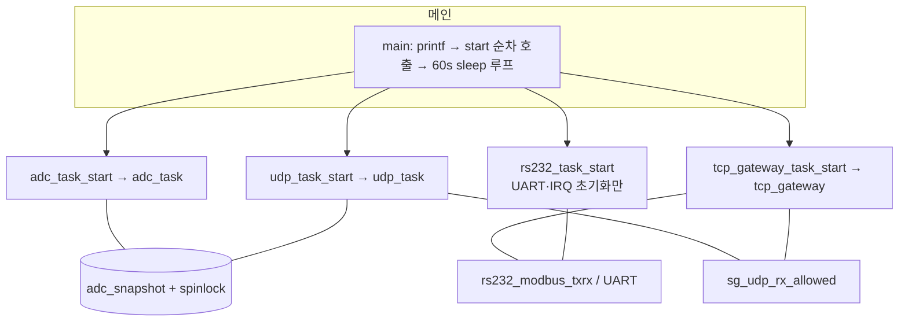
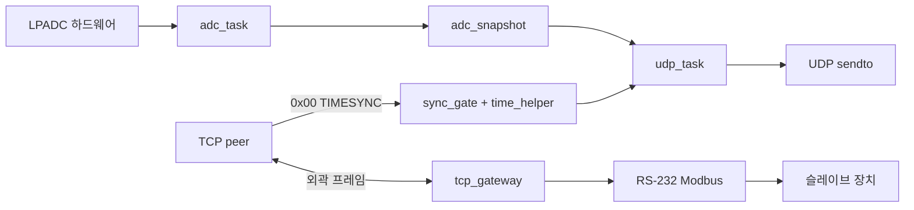

# Smart Gateway — 전체 시스템 Task 구조 설계

본 문서는 Zephyr **SmartGateway** 애플리케이션의 **스레드(태스크) 구성**, **시작 순서**, **우선순위·스택**, **태스크 간 데이터·동기화**를 코드 기준으로 정리합니다. (경로: `src/main.c` 및 각 모듈.)

---

## 1. 설계 개요

- **멀티태스크(RTOS)**: Zephyr `k_thread` 기반. 메인은 초기화 후 사실상 유휴(`k_sleep`)만 수행합니다.
- **역할 분리**
  - **ADC**: 주기 샘플링 및 2초 윈도 min/max 스냅샷 유지.
  - **UDP**: ADC 스냅샷을 MessagePack으로 인코딩해 피어로 주기 전송; 옵션 수신.
  - **TCP 게이트웨이**: 이더넷 TCP 프레임 ↔ RS-232 Modbus RTU 중계(별도 문서: `TCP_MODBUS_GATEWAY.md`).
  - **RS-232**: 별도 **백그라운드 스레드는 없음**. `rs232_task_start()`는 **UART 초기화·IRQ 콜백 등록**만 수행하고, Modbus 송수신은 **`tcp_gateway` 스레드 컨텍스트**에서 `rs232_modbus_txrx()` 호출로 동작합니다.
- **Kconfig 의존**: TCP Modbus 게이트웨이를 켜면 RS-232용 **UDP 패스스루 스레드는 생성하지 않는다**는 전제가 `Kconfig`/코멘트와 일치합니다.

---

## 2. 부팅 순서 (`main.c`)

실행 순서는 아래와 같습니다. 한 단계라도 실패하면 `main`이 `-1`로 종료합니다.

| 순번 | 호출 | 역할 |
|------|------|------|
| 1 | `adc_task_start()` | `adc_task` 스레드 생성 |
| 2 | `rs232_task_start()` | UART 포트 0 초기화, (가능 시) IRQ RX 링·ISR 연결 — **스레드 없음** |
| 3 | `udp_task_start()` | `udp_task` 스레드 생성 |
| 4 | `tcp_gateway_task_start()` | `tcp_gateway` 스레드 생성 |
| 5 | `while(1) { k_sleep(60s); }` | 메인 스레드 유지용 |

콘솔에 버전·보드·ADC/UDP/TCP 요약을 출력한 뒤 위 순서로 진행합니다.

---

## 3. 커널 스레드 목록 (애플리케이션 생성)

아래 세 개만 `k_thread_create`로 만듭니다.

| 스레드 이름 | 소스 | 스택(바이트) | 우선순위 | 진입 함수 |
|-------------|------|---------------|----------|-----------|
| `adc_task` | `adc.c` | 1536 | **5** | `adc_task` |
| `udp_task` | `udp.c` | 2048 (`UDP_STACK_SIZE`) | **4** | `udp_task` |
| `tcp_gateway` | `tcp_gateway.c` | 6144 (`TCP_GW_STACK`) | **5** | `tcp_gateway_task` |

모두 `K_NO_WAIT`로 즉시 스케줄 가능 상태로 시작합니다.

### 3.1 Zephyr 우선순위 해석

Zephyr에서는 일반적으로 **숫자가 작을수록 더 높은 스케줄링 우선순위**(선점 우선)입니다.

- 현재 설정: **`udp_task` = 4**, **`adc_task` / `tcp_gateway` = 5**.
- `udp.c` 주석에는 TCP(Modbus) 응답을 UDP 전송보다 우선시하려는 의도가 서술되어 있으나, **수치만 보면 UDP(4)가 ADC/TCP(5)보다 우선순위가 높습니다.** 실제 현장에서 스케줄링 이슈가 있으면 우선순위를 재조정하는 것이 좋습니다 (예: UDP를 더 “느슨한” 값으로).

---

## 4. 태스크별 책임 상세

### 4.1 `adc_task`

- LPADC 주기 읽기(`ADC_READ_INTERVAL_MS`, 코드 상 2ms).
- 채널당 running min/max 갱신 후, `ADC_WINDOW_MS`(2s)마다 `adc_snapshot` 갱신.
- 동기화: `adc_lock` **스핀락**으로 스냅샷 보호.
- 프로듀서: `adc_task` / 컨슈머: `udp_task`의 `adc_get_latest()`.

### 4.2 `udp_task`

- UDP 소켓 생성, (옵션) `BIND_PORT`로 수신 바인드, `PEER_IP:PEER_PORT`로 송신 목적지 설정.
- 루프(약 `UDP_SEND_INTERVAL_MS` = **2000ms** 주기, `udp.h`):
  1. (바인드 시) `udp_try_rx` — **TCP Modbus + sync_gate** 빌드에서는 `sg_udp_rx_allowed()`가 거짓인 동안 **수신 시도를 하지 않음**.
  2. `adc_get_latest` 실패 시 간헐 로그 후 sleep.
  3. `msgpack_encode_*` → `zsock_sendto`.

### 4.3 `tcp_gateway`

- **서버 모드**: `bind` → `listen` → `accept` 루프.
- **클라이언트 모드**: `connect` 루프, 세션 종료 시 재접속.
- 세션당: 핸드셰이크(0x80/0x00) → 0x01 요청 시 **`rs232_modbus_txrx()`** 로 RS-232 송수신 → 0x81 응답.
- TIMESYNC(0x00) 처리 시 `sync_gate` + `time_helper` 갱신.

### 4.4 RS-232 (스레드 없음)

- `rs232_task_start()`: 디바이스 트리 기준 포트 0(MikroBUS / `flexcomm5_lpuart5`) 설정, Baud 등 `Kconfig`.
- `CONFIG_UART_INTERRUPT_DRIVEN`이면 Modbus UART에 **ISR + 링 버퍼**로 RX 적재; 실제 읽기는 `tcp_gateway`가 부르는 경로에서 링/FIFO를 소비.
- 긴 Modbus 수신 루프는 `k_msleep`/`k_busy_wait` 정책으로 **다른 스레드 기아 완화**를 코드 주석에서 명시.

---

## 5. 태스크 간 공유 데이터·동기화

| 리소스 | 생산자 | 소비자 | 동기화 |
|--------|--------|--------|--------|
| `adc_snapshot_t` | `adc_task` | `udp_task` (`adc_get_latest`) | `k_spinlock` `adc_lock` |
| 벽시각 동기(Unix 등) | TCP TIMESYNC Body | `get_datetime`, UDP 타임스탬프 원천 | `time_helper` 내부 스핀락 등 |
| UDP RX 허용 플래그 | `sync_gate` (TCP 0x00 후 true) | `udp_try_rx` | `volatile bool` `sg_time_ok` |

**RS-232 UART**는 단일 스레드(`tcp_gateway`)에서 Modbus 트랜잭션 시 동기 호출로 사용하므로, Modbus 경로에 한해 별도 뮤텍스는 두지 않는 구조입니다. (UDP 패스스루 스레드가 살아 있는 구성에서는 경합 검토 필요 — 현재 TCP 게이트웨이 on 빌드에서는 해당 스레드 없음.)

---

## 6. ISR·컨텍스트

| 구성 요소 | 컨텍스트 | 비고 |
|-----------|----------|------|
| UART RX (Modbus) | ISR | 바이트를 링에 적재 |
| `adc_task` | 선점 가능 스레드 | 드라이버 ADC read |
| `tcp_gateway` | 선점 가능 스레드 | 소켓, 프레임 파싱, `rs232_modbus_txrx`에서 링 소비 |
| `udp_task` | 선점 가능 스레드 | 소켓, MessagePack |

---

## 7. 구조도 (Mermaid)

### 7.1 스레드·초기화 관계

### 7.2 데이터 흐름 요약

---

## 8. Kconfig와 태스크 구조의 연관

| 옵션 | 태스크 구조에 미치는 영향 |
|------|---------------------------|
| `SMARTGATEWAY_TCP_MODBUS_GATEWAY` | TCP 게이트웨이 스레드·프로토콜 활성; UDP RX 게이트 연동. |
| `SMARTGATEWAY_TCP_CLIENT_MODE` | `tcp_gateway`가 listen vs connect 분기. |
| `SMARTGATEWAY_RS232_ENABLE` | `rs232_task_start` 및 UART 계열 필수; TCP 게이트웨이는 이에 의존. |
| `SMARTGATEWAY_UDP_BIND_PORT` | `udp_task`에서 bind·`udp_try_rx` 경로. |
| ADC/RS-232 타임아웃·TCP 버퍼 등 | 각 태스크 루프의 지연·버퍼 크기 직접 연관. |

---

## 9. 관련 문서·소스

| 문서/파일 | 내용 |
|-----------|------|
| `docs/TCP_MODBUS_GATEWAY.md` | TCP 프레임·핸드셰이크·Modbus 중계 상세 |
| `src/main.c` | 시작 순서 |
| `src/adc.c`, `src/adc.h` | ADC 태스크·스냅샷 API |
| `src/udp.c`, `src/udp.h` | UDP 태스크·전송 주기 |
| `src/tcp_gateway.c` | TCP 태스크 |
| `src/rs232.c`, `src/rs232.h` | UART·Modbus TX/RX (스레드 없음) |
| `src/sync_gate.c` | TIMESYNC 후 UDP RX 허용 |
| `src/time_helper.c` | 시각 동기 |
| `Kconfig` | 전역 옵션 |

---

*본 문서는 저장소 소스의 현재 상태를 반영합니다. 우선순위·스택 크기·`main` 호출 순서를 변경한 경우 이 문서를 함께 갱신하십시오.*
