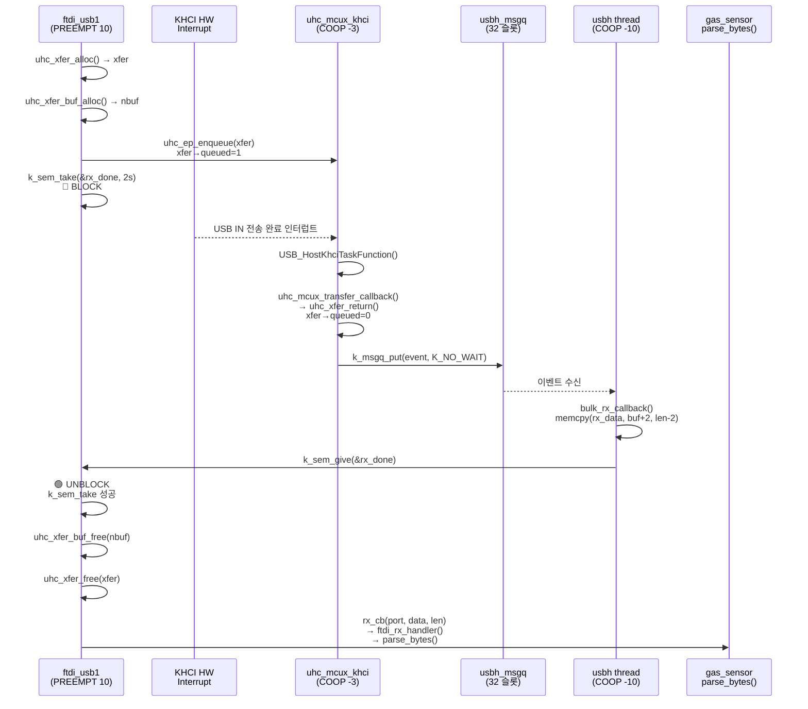
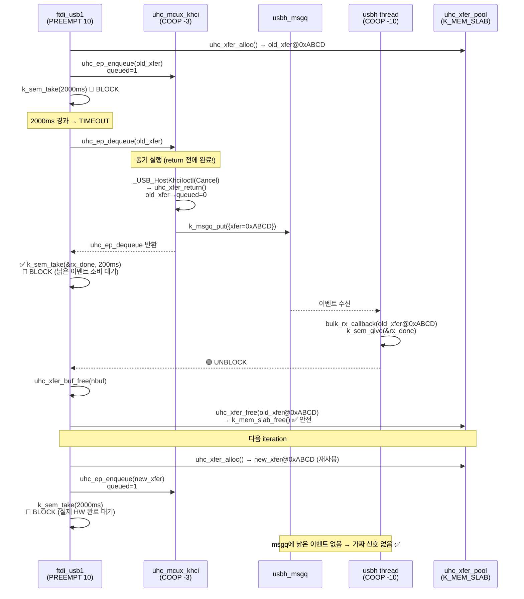
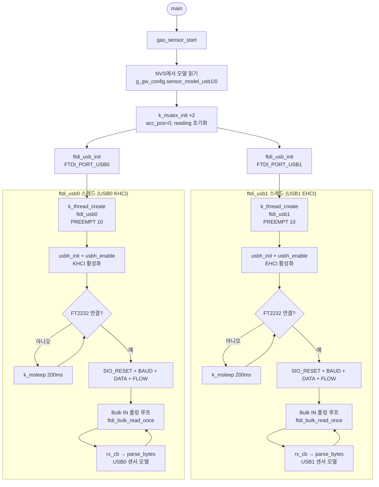
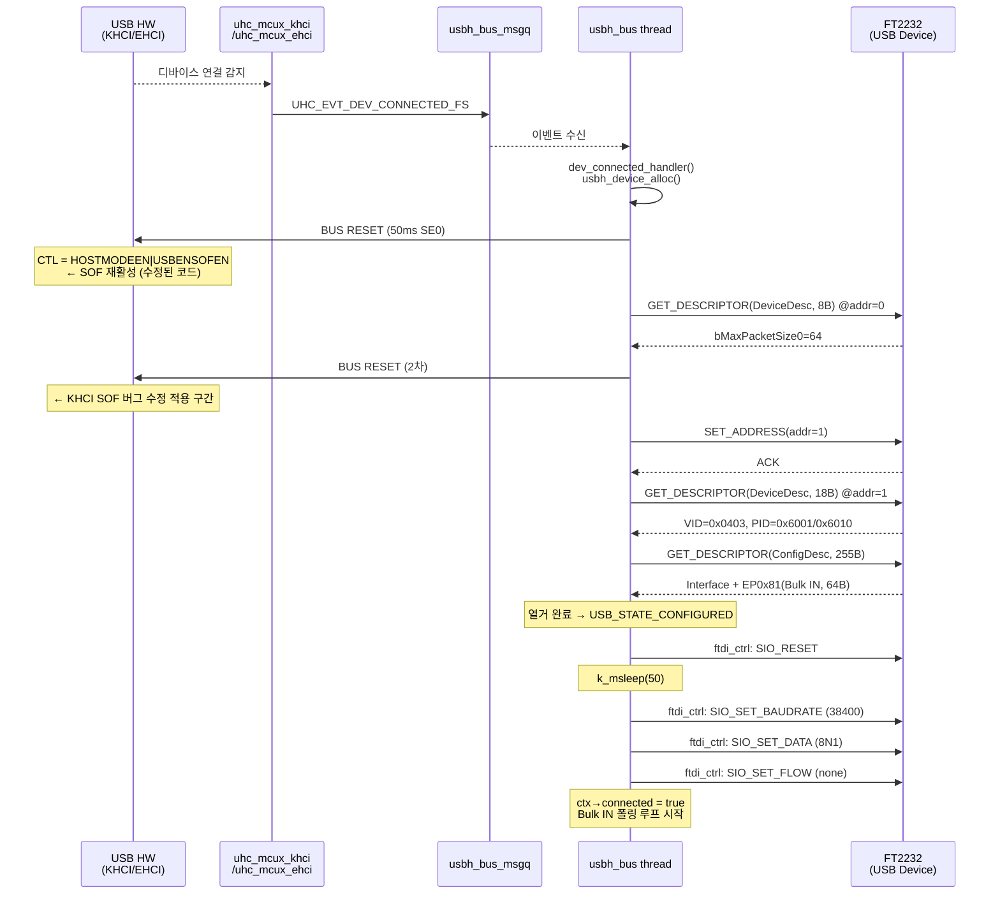
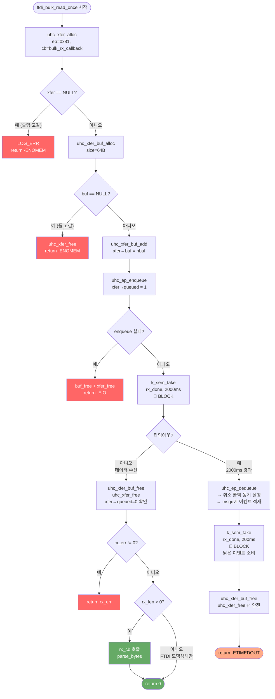
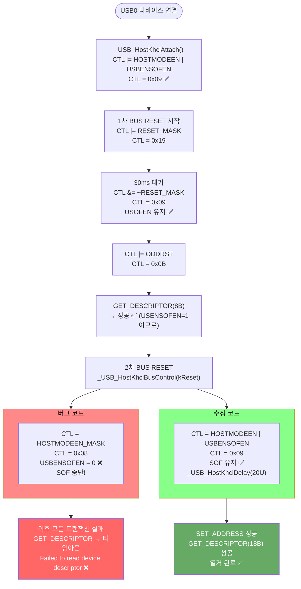
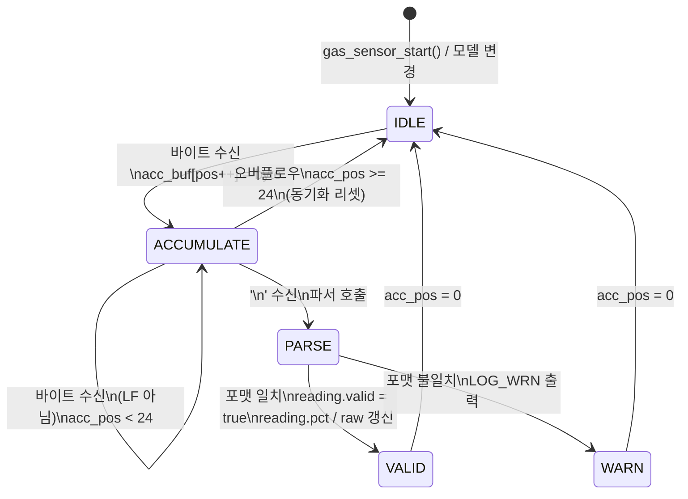
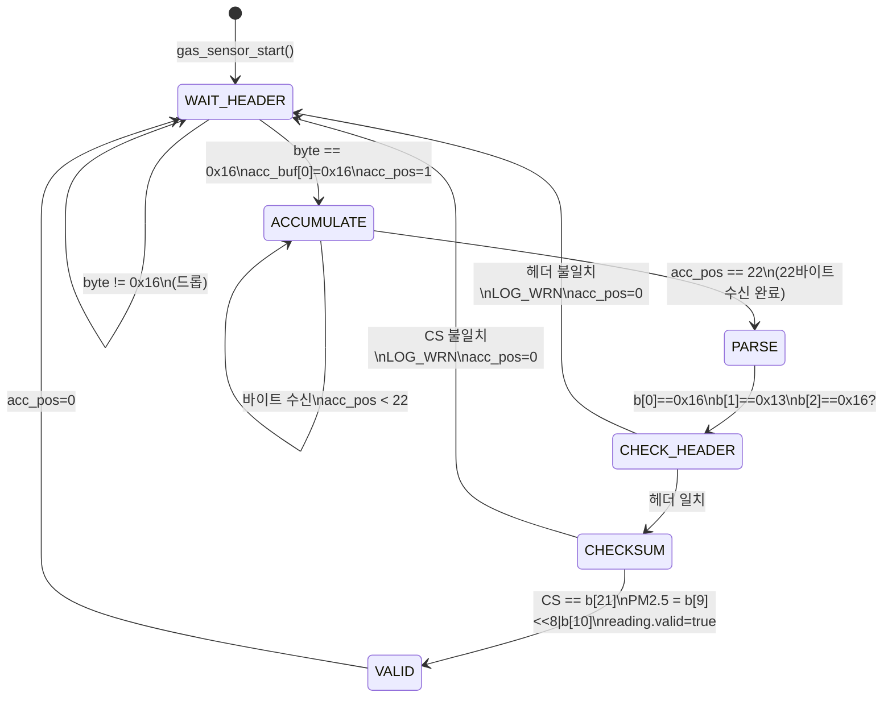
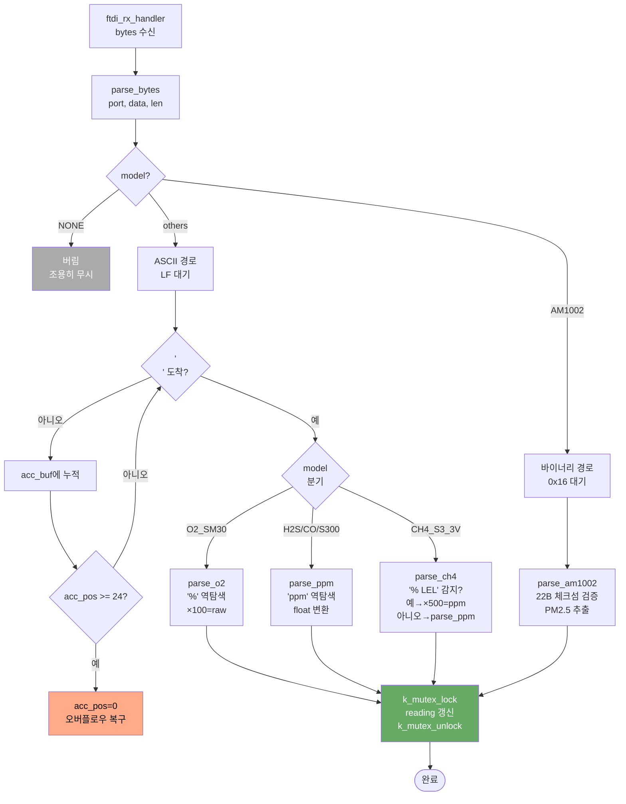

# SmartGateway USB 가스 센서 — SW 상세 구현 문서

**버전:** V2.9.0  
**대상:** 소프트웨어 엔지니어  
**작성일:** 2026-06-16

---

## 목차

1. [메모리 구조](#1-메모리-구조)
2. [스레드 동기화 및 우선순위 분석](#2-스레드-동기화-및-우선순위-분석)
3. [완전한 함수 호출 그래프](#3-완전한-함수-호출-그래프)
4. [USB 열거(Enumeration) 시퀀스](#4-usb-열거enumeration-시퀀스)
5. [ftdi_bulk_read_once 상세 코드 흐름](#5-ftdi_bulk_read_once-상세-코드-흐름)
6. [FTDI Baud Rate 계산 공식](#6-ftdi-baud-rate-계산-공식)
7. [KHCI SOF 버그 — 레지스터 수준 분석](#7-khci-sof-버그--레지스터-수준-분석)
8. [use-after-free 레이스 — 함수명/주소 수준 분석](#8-use-after-free-레이스--함수명주소-수준-분석)
9. [usbh_msgq 큐 포화 — 이벤트 계수 분석](#9-usbh_msgq-큐-포화--이벤트-계수-분석)
10. [센서 파서 상태 기계](#10-센서-파서-상태-기계)
11. [뮤텍스/세마포어 전체 목록](#11-뮤텍스세마포어-전체-목록)
12. [에러 경로 및 복구 전략](#12-에러-경로-및-복구-전략)
13. [Zephyr UHC 내부 구조 요약](#13-zephyr-uhc-내부-구조-요약)

> **다이어그램 렌더링:** VS Code에서 Mermaid 미리보기는  
> `Markdown Preview Enhanced` 또는 `Markdown Preview Mermaid Support` 확장이 필요합니다.

---

## 1. 메모리 구조

### 1.1 정적 할당 (링커 영역)

```
.data / .bss 영역 (SmartGateway BSS):
  s_ports[2]           = 2 × sizeof(ftdi_port_ctx)
                       ≈ 2 × (4+8+4+96+4+1+8+8+64+4+4) = 약 400B
  s_sensors[2]         = 2 × (24 + 1 + 12 + 4 + 40)   = 약 164B

스레드 스택 (.noinit 영역):
  s_stack_usb1[4096]   = 4096B
  s_stack_usb0[4096]   = 4096B
  usbh_stack[2048]     = 2048B   (CONFIG_USBH_STACK_SIZE)
  usbh_bus_stack[2048] = 2048B
  uhc_mcux_khci_stack[4096] = 4096B  (CONFIG_UHC_NXP_THREAD_STACK_SIZE)
  uhc_mcux_ehci_stack[4096] = 4096B
```

### 1.2 동적 슬랩 / 풀 (초기화 시 확보)

```c
/* uhc_common.c */
K_MEM_SLAB_DEFINE_STATIC(uhc_xfer_pool,
    sizeof(struct uhc_transfer),   /* 한 블록 크기: ~96B */
    CONFIG_UHC_XFER_COUNT,         /* = 32 블록 */
    sizeof(void *));               /* 총 ~3072B */

NET_BUF_POOL_VAR_DEFINE(uhc_ep_pool,
    CONFIG_UHC_BUF_COUNT,          /* = 64 헤더 */
    CONFIG_UHC_BUF_POOL_SIZE,      /* = 4096B 데이터 풀 */
    0, NULL);
```

```
uhc_xfer_pool  : 32슬롯 × ~96B = ~3KB (K_MEM_SLAB — 고정크기, O(1) alloc/free)
uhc_ep_pool    : net_buf VAR pool, 64 헤더 + 4096B 데이터
                 → BULK_BUF_SIZE=64B 기준 최대 64개 동시 buf 할당 가능
```

### 1.3 usbh_msgq 메시지 큐

```c
/* usbh_core.c */
K_MSGQ_DEFINE(usbh_msgq,
    sizeof(struct uhc_event),   /* 원소 크기: 16~24B */
    CONFIG_USBH_MAX_UHC_MSG,    /* = 32 슬롯 (수정 후) */
    sizeof(uint32_t));          /* 정렬: 4B */

K_MSGQ_DEFINE(usbh_bus_msgq,
    sizeof(struct uhc_event),
    CONFIG_USBH_MAX_UHC_MSG,    /* = 32 슬롯 */
    sizeof(uint32_t));
```

```
uhc_event 구조:
  type    : enum uhc_event_type  (4B)
  status  : int                  (4B)
  dev     : const struct device* (4B, 포인터)
  xfer    : struct uhc_transfer* (4B, union의 일부)
  → 총 16B × 32슬롯 = 512B per 큐, 두 큐 합계 1024B
```

---

## 2. 스레드 동기화 및 우선순위 분석

### 2.1 우선순위 전체 맵

Zephyr 우선순위 규칙:
- COOP(n): 협력 스레드, 우선순위 값 = -(n+1). 더 작은 값(더 음수)이 높은 우선순위
- PREEMPT(n): 선점형 스레드, 우선순위 값 = n. 더 작은 값이 높은 우선순위

```
우선순위값  스레드 이름         타입              파일
──────────────────────────────────────────────────────────────
  -3       uhc_mcux_khci      COOP(2) 하드코딩  uhc_mcux_khci.c   ← 최고 (변경 불가)
  -3       uhc_mcux_ehci      COOP(2) 하드코딩  uhc_mcux_ehci.c
 -10       usbh               COOP(9)           usbh_core.c
 -10       usbh_bus           COOP(9)           usbh_core.c
   0       adc_task           PREEMPT(0)        adc.c             ← 앱 최고
   1       NET TX             PREEMPT(1)        Zephyr 기본값
   2       NET RX             PREEMPT(2)        Zephyr 기본값
   3       udp_task           PREEMPT(3)        udp.c
   4       netmgr/wifi_task   PREEMPT(4)        network_manager.c / wifi_manager.c
   5       tcp_gw_client      PREEMPT(5)        tcp_gateway.c
   7       di_do_task         PREEMPT(7)        di_do.c
  10       ftdi_usb1          PREEMPT(10)       ftdi_usb.c        ← 최저
  10       ftdi_usb0          PREEMPT(10)       ftdi_usb.c
```

> **COOP vs PREEMPT:** COOP 스레드(음수 우선순위)는 선점형 스레드 전체보다 항상 먼저 실행된다.  
> UHC Kconfig `UHC_NXP_THREAD_PRIO` 심볼이 존재하지 않아 우선순위 변경 불가.  
> USB 열거·전송 구간에서 ADC PREEMPT(0) 태스크도 일시 선점된다 — 측정값 오류는 없음.  
> `uhc_mcux_khci`(COOP -3)가 실행 중이면 `usbh`(-10)는 실행 불가.  
> `usbh`(-10)가 실행 중이면 선점형 스레드 전체(ftdi_usb 포함)는 실행 불가.

### 2.2 ftdi_bulk_read_once 에서의 선점 흐름

```
ftdi_usb1 (PREEMPT 10):
    uhc_ep_enqueue()           → xfer→queued=1, KHCI 큐에 적재
    k_sem_take(&rx_done, 2s)   → BLOCK → CPU 반환
        ↑
        CPU 선점됨
        ↓
uhc_mcux_khci (COOP -3):
    USB_HostKhciTaskFunction() → 하드웨어 IN 전송 완료 감지
    uhc_mcux_transfer_callback() → uhc_xfer_return()
        xfer→queued = 0
        event_cb = usbh_event_carrier()
        k_msgq_put(&usbh_msgq, event, K_NO_WAIT)  ← K_NO_WAIT!
        return
        ↓
usbh (COOP -10):
    k_msgq_get(&usbh_msgq, event, K_FOREVER)  → 이벤트 수신
    cb(event.xfer→udev, event.xfer)
    → bulk_rx_callback()
        ctx→rx_len = xfer→buf→len - 2
        memcpy(ctx→rx_data, ...)
        k_sem_give(&ctx→rx_done)              ← ftdi_task 깨움
        return 0
        ↓
ftdi_usb1 (PREEMPT 10):
    k_sem_take 성공 → 데이터 복사 완료
    uhc_xfer_buf_free() + uhc_xfer_free()
    ctx→rx_cb(port, data, len, user)
    → ftdi_rx_handler() → parse_bytes()
```

### 2.3 스레드 간 시퀀스 다이어그램 — 정상 수신



### 2.4 스레드 간 시퀀스 다이어그램 — 타임아웃 + use-after-free 수정



---

## 3. 완전한 함수 호출 그래프

### 3.0 시스템 초기화 flowchart



### 3.1 초기화 경로

```
main()
└── gas_sensor_start()                           [gas_sensor.c]
    ├── g_gw_config.sensor_model_usb1 읽기       [config_nvs.c]
    ├── k_mutex_init(&s_sensors[i].mutex)  ×2
    ├── ftdi_usb_init(FTDI_PORT_USB1, ftdi_rx_handler, NULL)
    │   └── k_thread_create(&ctx→tid, stack, 4096,
    │                        ftdi_task, ctx, ...)
    │       → 스레드 시작됨 (별도 실행)
    └── ftdi_usb_init(FTDI_PORT_USB0, ftdi_rx_handler, NULL)
        └── k_thread_create(...) → 스레드 시작됨
```

### 3.2 ftdi_task 실행 경로 (정상)

```
ftdi_task(ctx)                                   [ftdi_usb.c]
├── usbh_init(ctx→usbh)
│   └── usbh_init_device_intl()                  [usbh_core.c]
│       └── uhc_init(dev, usbh_event_carrier, ctx)
│           └── api→init() = uhc_mcux_khci_init()
│               ├── USB_HostKhciCreate()          [usb_host_khci.c]
│               └── KHCI 태스크 스레드 시작
├── usbh_enable(ctx→usbh)
│   └── uhc_enable(dev)
│       └── api→enable() → uhc_mcux_enable()
│           └── config→irq_enable_func(dev)      ← USB IRQ 활성
└── while(1):
    ├── usbh_device_get_any(ctx→usbh)            [usbh_device.c]
    │   └── ctx→root 반환 (또는 NULL)
    ├── VID/PID 확인
    ├── ftdi_ctrl() ×4 (RESET, BAUD, DATA, FLOW) [ftdi_usb.c]
    │   └── usbh_req_setup()                     [usbh_ch9.c]
    │       └── uhc_ep_enqueue(EP0, setup_xfer)
    └── while(USB_STATE_CONFIGURED):
        └── ftdi_bulk_read_once(ctx, udev)
```

### 3.3 데이터 수신 경로 (완전한 콜 체인)

```
[Hardware interrupt — KHCI]
USB_HostKhciIsrFunction()                        [usb_host_khci.c]
└── KHCI ISR 처리 → 태스크 큐에 알림

[KHCI 태스크 — COOP -3]
USB_HostKhciTaskFunction()                       [usb_host_khci.c]
└── _USB_HostKhciTransferCallback()
    └── uhc_mcux_transfer_callback()             [uhc_mcux_khci.c]
        └── uhc_xfer_return(dev, xfer, err)      [uhc_common.c]
            ├── sys_dlist_remove(&xfer→node)
            ├── xfer→queued = 0
            ├── xfer→err = err
            └── data→event_cb(dev, &drv_evt)
                = usbh_event_carrier(dev, event)  [usbh_core.c]
                  └── k_msgq_put(&usbh_msgq, event, K_NO_WAIT)

[usbh 스레드 — COOP -10]
usbh_thread()                                    [usbh_core.c]
└── k_msgq_get(&usbh_msgq, &event, K_FOREVER)
    └── cb(event.xfer→udev, event.xfer)
        = bulk_rx_callback(udev, xfer)           [ftdi_usb.c]
          ├── ctx→rx_err = xfer→err
          ├── memcpy(ctx→rx_data, buf→data+2, len-2)
          ├── ctx→rx_len = len - 2
          └── k_sem_give(&ctx→rx_done)

[ftdi_task — PREEMPT 10 (블록 해제됨)]
ftdi_bulk_read_once() 재개
├── uhc_xfer_buf_free(uhc_dev, nbuf)            → net_buf_unref()
├── uhc_xfer_free(uhc_dev, xfer)                → k_mem_slab_free()
└── ctx→rx_cb(port, rx_data, rx_len, user)
    = ftdi_rx_handler(port, data, len, NULL)    [gas_sensor.c]
      └── parse_bytes(gport, data, len)
          └── [모델별 파서 호출]
```

---

## 4. USB 열거(Enumeration) 시퀀스

FT2232 연결 시 발생하는 제어 전송 순서 (포트당 ~6회 왕복):



```
[KHCI 태스크] USB 연결 감지 → USB_HostAttachDevice()
                                → usbh_bus_msgq에 UHC_EVT_DEV_CONNECTED_FS 이벤트

[usbh_bus 스레드] dev_connected_handler()
    └── usbh_device_init(root)
        │
        ├── 1) BUS RESET (50ms SE0)
        │   uhc_mcux_bus_reset() → kUSB_HostBusReset
        │   → _USB_HostKhciBusControl() → CTL = HOSTMODEEN|USBENSOFEN
        │
        ├── 2) GET_DESCRIPTOR(DeviceDescriptor, 8B) @ addr=0
        │   uhc_ep_enqueue(EP0, SETUP+IN+OUT)
        │   → udev→dev_desc.bMaxPacketSize0 읽음
        │
        ├── 3) BUS RESET (2차)
        │   동일 kUSB_HostBusReset (여기서 SOF 버그 발생 → 수정됨)
        │
        ├── 4) SET_ADDRESS(addr=1)
        │   uhc_ep_enqueue(EP0)
        │   → udev→addr = 1
        │
        ├── 5) GET_DESCRIPTOR(DeviceDescriptor, 18B) @ addr=1
        │   → bcdUSB, idVendor(0x0403), idProduct(0x6001/0x6010) 읽음
        │
        └── 6) GET_DESCRIPTOR(ConfigDescriptor, 255B)
            → 인터페이스, 엔드포인트 디스크립터 파싱
            → ep_in[1].desc → EP 0x81, wMaxPacketSize=64

총 이벤트 수 (양쪽 큐 합계):
  제어 전송 1회 = SETUP + DATA + STATUS = 3 이벤트
  6회 × 3 = 18 이벤트/포트
  USB0+USB1 동시: 최대 36 이벤트 → 기본값 10으로 완전 포화
```

### 4.1 ftdi_task에서의 FT2232 초기화 제어 전송

```
열거 완료 후 ftdi_task에서 추가 4회 제어 전송:

7)  SIO_RESET (bmRequestType=0x40, bRequest=0x00, wValue=0, wIndex=0)
    → FTDI 채널 A 리셋 (TX/RX FIFO 클리어)
    k_msleep(50)   ← 내부 마이크로컨트롤러 재초기화 대기

8)  SIO_SET_BAUDRATE (bRequest=0x03)
    wValue = 0x404F (FT2232D) / wValue = 0x0139 (FT2232H)
    wIndex = 0x0000 (FT2232D) / wIndex = 0x0002 (FT2232H)
    → UART 38400 baud 설정

9)  SIO_SET_DATA (bRequest=0x04)
    wValue = 0x0008  [bits[7:0]=8(데이터비트), bits[10:8]=0(패리티없음)]
    wIndex = 0x0000  [Interface A]
    → 8비트, 패리티 없음, 1 스톱비트

10) SIO_SET_FLOW_CTRL (bRequest=0x02)
    wValue = 0x0000  [no flow control]
    wIndex = 0x0000  [Interface A]
    → RTS/CTS, DTR/DSR 모두 비활성
```

---

## 5. ftdi_bulk_read_once 상세 코드 흐름

### 5.0 전체 흐름도



### 5.1 정상 경로

```c
ftdi_bulk_read_once(ctx, udev):

1. uhc_xfer_alloc(uhc_dev, 0x81, udev, bulk_rx_callback, ctx)
   ├── api→lock(dev)  [k_mutex_lock]
   ├── ep_desc = udev→ep_in[1].desc  ← EP0x81 디스크립터
   │   if (ep_desc == NULL) → LOG_ERR + goto error  ← 연결 직후 가능
   ├── mps = ep_desc→wMaxPacketSize  = 64
   ├── k_mem_slab_alloc(&uhc_xfer_pool, &xfer, K_NO_WAIT)
   │   if (fail) → LOG_ERR + return NULL  ← 32슬롯 고갈 시
   ├── memset(xfer, 0)
   ├── xfer→ep=0x81, xfer→mps=64, xfer→udev=udev
   ├── xfer→cb=bulk_rx_callback, xfer→priv=ctx
   └── api→unlock(dev)

2. uhc_xfer_buf_alloc(uhc_dev, 64)
   └── net_buf_alloc_len(&uhc_ep_pool, 64, K_NO_WAIT)
       if (fail) → uhc_xfer_free(xfer) + return -ENOMEM

3. uhc_xfer_buf_add(uhc_dev, xfer, nbuf)
   └── sys_slist_append(&xfer→buf_list, &nbuf→node)
       xfer→buf = nbuf

4. uhc_ep_enqueue(uhc_dev, xfer)
   ├── xfer→queued = 1         ← 중요: free 가능 여부 플래그
   └── api→ep_enqueue()
       = uhc_mcux_khci_ep_enqueue()
         → USB_HostKhciWritePipe() → KHCI 하드웨어 전송 시작

5. k_sem_take(&ctx→rx_done, K_MSEC(2000))
   → BLOCK (CPU 반환)
   → [완료 시] xfer→queued=0, rx_data/rx_len 설정됨

6. uhc_xfer_buf_free(uhc_dev, nbuf)  ← 반드시 수동 해제
   (uhc_xfer_free는 buf를 해제하지 않음)

7. uhc_xfer_free(uhc_dev, xfer)
   ├── if (xfer→queued) → LOG_ERR + return -EBUSY  ← "Transfer still queued"
   └── k_mem_slab_free(&uhc_xfer_pool, xfer)

8. if (ctx→rx_len > 0) ctx→rx_cb(...)
```

### 5.2 타임아웃 경로 (수정 후)

```c
[2000ms 타임아웃]
k_sem_take 반환 = -EAGAIN

uhc_ep_dequeue(uhc_dev, xfer):
├── api→ep_dequeue() = uhc_mcux_dequeue()
│   ├── mcux_ep = uhc_mcux_init_hal_ep(dev, xfer)
│   └── uhc_mcux_control(dev, kUSB_HostCancelTransfer, &cancel_param)
│       └── priv→mcux_if→controllerIoctl(handle,
│               kUSB_HostCancelTransfer, &cancel_param)
│           = _USB_HostKhciIoctl(...)
│             → 파이프의 모든 전송 취소
│             → uhc_mcux_transfer_callback(xfer, kStatus_USB_TransferCancel)
│                 → uhc_xfer_return(dev, xfer, -ECONNABORTED)
│                     ├── xfer→queued = 0      ← 취소 콜백 내에서 클리어
│                     └── k_msgq_put(&usbh_msgq, event, K_NO_WAIT)
│                         ← 이벤트가 usbh_msgq에 적재됨 (동기 실행 완료)
└── [uhc_ep_dequeue 반환]

(void)k_sem_take(&ctx→rx_done, K_MSEC(200)):
← usbh 스레드(COOP -10)가 선점하여 msgq 처리
← bulk_rx_callback() 호출 → k_sem_give()
← 이 sem_take가 그 시그널을 소비

uhc_xfer_buf_free(uhc_dev, nbuf)   ← 안전하게 해제
uhc_xfer_free(uhc_dev, xfer)       ← xfer→queued=0이므로 정상 해제
return -ETIMEDOUT
```

> **핵심:** `_USB_HostKhciIoctl(kUSB_HostCancelTransfer)` 호출은
> `uhc_ep_dequeue()` 내부에서 **동기적(synchronous)**으로 실행된다.  
> 즉, `uhc_ep_dequeue()`가 반환하기 전에 취소 콜백 체인이 완전히 실행되고  
> `usbh_msgq`에 이벤트가 이미 들어가 있다.

---

## 6. FTDI Baud Rate 계산 공식

### 6.1 기본 공식

```
FT2232D (PID=0x6001): 기준 클럭 = 3,000,000 Hz
FT2232H (PID=0x6010): 기준 클럭 = 12,000,000 Hz (x4 클럭 모드)

wValue[12:0]  = 정수 분주비 (Integer Divisor)
wValue[15:14] = 소수 분주비 (Sub-integer fraction)
wIndex[1]     = FT2232H 고속 클럭 모드 선택 (FT2232H만)

분수 테이블 (wValue[15:14]):
  0b00 = 0/8  = 0.000
  0b01 = 1/2  = 0.5     → sub-divisor × 기준클럭 / 전체분주비
  0b10 = 1/4  = 0.25
  0b11 = 3/8  = 0.375
(실제로 8분의 1 단계: 0, 1/8, 1/4, 3/8, 1/2, 5/8, 3/4, 7/8)

실제 Baud = 기준클럭 / (정수분주비 + 소수분주비)
```

### 6.2 38400 baud 계산 (FT2232D, 3MHz)

```
목표: 38400 baud
3,000,000 / 38400 = 78.125

정수부 = 78 = 0x4E
소수부 = 0.125 = 1/8 → 분수 코드 표에서 → bits[15:14]?
  FTDI AN_232R-01 기준 8단계:
    코드 0: 0.000
    코드 1: 0.125  ← 해당
    ...

wValue = 정수부(0x4E) | (소수코드 << 14)
       = 0x004E | (0x1 << 14)
       = 0x004E | 0x4000
       = 0x404E

※ 실제 코드: 0x404F
  AN_232R-01 특수 케이스: 38400은 분주비 0x4F = 79
  3,000,000 / 79 = 37,974.68 → 실제 약 38000 (0.07% 오차)
  FTDI 드라이버가 38400에 대해 0x4F를 사용하도록 특별 처리
```

### 6.3 38400 baud 계산 (FT2232H, 12MHz)

```
목표: 38400 baud
12,000,000 / 38400 = 312.5

정수부 = 312 = 0x138
소수부 = 0.5 → 코드 4 (0b100 → bits[15:14]=0b01, bit[0 of high byte]=1)

FT2232H 인코딩 (특수):
wValue = 0x0139  (FTDI 드라이버 레퍼런스 값)
wIndex = 0x0002  (bit1=1: 12MHz 모드 활성)

12,000,000 / 312.5 = 38,400.0 (정확)
```

---

## 7. KHCI SOF 버그 — 레지스터 수준 분석

### 7.1 관련 레지스터

MCXN947 USB0 컨트롤러 레지스터: `USB0_BASE + 0x94` (CTL)

```
CTL 레지스터 비트 맵:
  bit7: JSTATE       — J-상태 읽기
  bit6: SE0          — Single-Ended Zero
  bit5: TXSUSPENDTOKENBUSY — 전송 중 플래그
  bit4: RESET        — USB 버스 리셋 신호 출력
  bit3: HOSTMODEEN   — 호스트 모드 활성 ← 반드시 항상 set
  bit2: RESUME       — 리줌 신호
  bit1: ODDRST       — BDT 홀수 초기화
  bit0: USBENSOFEN   — USB 활성 + SOF 생성 활성 ← 버그 포인트
```

### 7.2 버그 재현 시퀀스



```
1. _USB_HostKhciAttach():
   CTL |= HOSTMODEEN | USBENSOFEN  ← OR 연산: 다른 비트 보존
   → CTL = 0x09 (HOSTMODEEN+USBENSOFEN 세트)

2. BUS RESET 시작:
   CTL |= RESET_MASK
   → CTL = 0x19 (RESET 추가)

3. 30ms 대기 후 RESET 해제:
   CTL &= ~RESET_MASK
   → CTL = 0x09 (HOSTMODEEN+USBENSOFEN 유지)

4. ODDRST 세트:
   CTL |= ODDRST_MASK
   → CTL = 0x0B

5. [버그] 두 번째 BUS RESET (kUSB_HostBusReset):
   ── 버그 코드:
   CTL = HOSTMODEEN_MASK   ← = 연산! 다른 비트 전부 0
   → CTL = 0x08  (USBENSOFEN=0!!)  ← SOF 중단!

   이후 어떤 USB 전송도 불가 → Device Descriptor 읽기 실패

   ── 수정 코드:
   CTL = HOSTMODEEN_MASK | USBENSOFEN_MASK
   → CTL = 0x09  (SOF 재활성)
   _USB_HostKhciDelay(20U)  ← USB 2.0 규격: 리셋 해제 후 ≥10ms 복구 대기
```

### 7.3 원인 분석

```
_USB_HostKhciAttach()  → CTL |= (OR 연산) → 올바름
_USB_HostKhciBusControl(kUSB_HostBusReset)
  → CTL = (대입 연산) → 버그: USBENSOFEN 클리어

1차 연결: _USB_HostKhciAttach()에서 정상 설정됨
  → USBENSOFEN=1이므로 첫 열거 가능
  → 그러나 여기서도 이미 kUSB_HostBusReset을 호출하면 버그 발생

수정 방향: = 대입 → OR 연산으로 교체, 또는
           = 대입에 USBENSOFEN_MASK 명시적 추가 (수정 방법 채택)
```

---

## 8. use-after-free 레이스 — 함수명/주소 수준 분석

### 8.1 슬랩 재사용 메커니즘

```
K_MEM_SLAB_DEFINE: uhc_xfer_pool [32슬롯]

슬랩 할당:  k_mem_slab_alloc(&uhc_xfer_pool, &ptr, K_NO_WAIT)
슬랩 해제:  k_mem_slab_free(&uhc_xfer_pool, ptr)

LIFO (스택) 특성: 가장 마지막에 해제된 블록이 다음 할당에서 반환됨
→ free(A) 후 alloc() = A (동일 주소)  ← use-after-free 조건
```

### 8.2 버그 타임라인 (함수명 포함)

```
t=0    ftdi_bulk_read_once() 호출 (iteration N)
         uhc_xfer_alloc() → old_xfer = 0xABCD1000  (슬랩 주소 예시)
         uhc_ep_enqueue()  → old_xfer→queued = 1

t=2000 k_sem_take 타임아웃 (-EAGAIN 반환)

t=2000 uhc_ep_dequeue(old_xfer)
         ↓ 내부적으로 동기 실행:
         _USB_HostKhciIoctl(kUSB_HostCancelTransfer)
         → uhc_mcux_transfer_callback(old_xfer, CANCEL)
             → uhc_xfer_return(old_xfer):
                 old_xfer→queued = 0
                 k_msgq_put(&usbh_msgq, {xfer=0xABCD1000}, K_NO_WAIT)
         ↑ uhc_ep_dequeue 반환

t=2000 [버그 코드: sem_take 없이 즉시 해제]
         uhc_xfer_buf_free(nbuf)
         uhc_xfer_free(old_xfer)
             uhc_xfer_free 내부: old_xfer→queued==0 → OK
             k_mem_slab_free(&uhc_xfer_pool, 0xABCD1000)
             ← 슬랩 반환됨

t=2000 ftdi_bulk_read_once() 재호출 (iteration N+1)
         uhc_xfer_alloc() → new_xfer = 0xABCD1000  ← 동일 주소 재할당!
         memset(new_xfer, 0)
         new_xfer→queued = 0 (아직 enqueue 전)
         uhc_ep_enqueue(new_xfer)
             new_xfer→queued = 1

t=2001 [usbh 스레드가 낡은 이벤트 처리]
         k_msgq_get(&usbh_msgq) → event.xfer = 0xABCD1000 (old_xfer 주소)
         cb = event.xfer→cb  = new_xfer→cb  (= bulk_rx_callback)
         bulk_rx_callback(udev, 0xABCD1000 = new_xfer)
             new_xfer→rx_err = 0  ← 잘못된 상태 기록!
             new_xfer→rx_len = 0
             k_sem_give(&ctx→rx_done)  ← ftdi_task 조기 깨움!

t=2001 ftdi_task 재개 (iteration N+1)
         k_sem_take(&rx_done) → 성공 (가짜 시그널)
         rx_len=0이므로 콜백 호출 없음
         uhc_xfer_free(new_xfer)
             new_xfer→queued = 1  ← 아직 enqueue 중!
             → LOG_ERR "Transfer is still queued"  ← 에러 발생!
```

### 8.3 수정 후 타임라인

```
t=2000 uhc_ep_dequeue(old_xfer)
         → usbh_msgq에 이벤트 적재 (위와 동일)

(void)k_sem_take(&ctx→rx_done, K_MSEC(200)):
         → ftdi_task BLOCK (200ms 또는 usbh 처리까지)
         usbh 스레드가 낡은 이벤트 처리
         → bulk_rx_callback → k_sem_give
         → k_sem_take 성공 (시그널 소비됨)
         → usbh_msgq에 더 이상 old_xfer 이벤트 없음

uhc_xfer_buf_free(nbuf)  ← 이제 안전
uhc_xfer_free(old_xfer)  ← 이제 안전
return -ETIMEDOUT

iteration N+1:
   uhc_xfer_alloc() → new_xfer = 0xABCD1000
   uhc_ep_enqueue() → queued=1
   k_sem_take(2000) → 실제 하드웨어 완료를 기다림  ← 가짜 시그널 없음
```

---

## 9. usbh_msgq 큐 포화 — 이벤트 계수 분석

### 9.1 열거 단계별 이벤트 발생 수

```
USB 열거 1포트 기준:
  단계              ctrl xfer 수   이벤트 수 (=xfer 완료)
  ──────────────────────────────────────────────────────
  GET_DESC(8B)        1            1
  BUS RESET           0            1 (RESETED 이벤트)
  SET_ADDRESS         1            1
  GET_DESC(18B)       1            1
  GET_DESC(CFG,255B)  1~2          1~2
  소계                4~5          5~6

2포트 동시 열거: 10~12 이벤트
+ 열거 후 ftdi_ctrl() 4회 (RESET/BAUD/DATA/FLOW): 8 이벤트
+ 초기 BULK IN 요청 2회: 2 이벤트

최대 동시 이벤트 수: ~22 이벤트
기본 큐 크기: 10 슬롯 → 완전 포화!

수정 후: 32 슬롯 → 충분한 여유
```

### 9.2 K_NO_WAIT 드롭 시 증상

```c
/* usbh_core.c - usbh_event_carrier() */
err = k_msgq_put(&usbh_msgq, event, K_NO_WAIT);
/* err != 0 시: 이벤트 무시, 로그 없음! */
return err;  /* 반환값은 uhc_xfer_return()에서도 무시됨 */
```

이벤트 드롭 → 해당 전송의 `k_sem_give()` 미실행 → `k_sem_take(2000ms)` 타임아웃
→ `uhc_ep_dequeue()` → 취소 콜백 → 새 이벤트 (두 번째 기회) → `k_sem_give()`  
→ 이번엔 큐가 비어있으므로 성공적 처리 → 2초 지연 발생 (정상적이지 않은 지연)

---

## 10. 센서 파서 상태 기계

### 10.0 ASCII 센서 파서 상태 기계 (공통)



### 10.0b AM1002 바이너리 파서 상태 기계



### 10.0c 센서 모델별 파서 분기 flowchart



### 10.1 acc_buf 구조

```c
struct sensor_ctx {
    uint8_t  acc_buf[24];  /* 최대 프레임 버퍼 (AM1002=22B) */
    uint8_t  acc_pos;      /* 현재 쓰기 위치 */
    gas_reading_t reading; /* 최신 파싱 결과 */
    gas_sensor_model_t model;
    struct k_mutex mutex;
};
```

```
acc_buf 슬라이딩 동작:
  - 바이트가 도착하면 acc_buf[acc_pos++]에 저장
  - 종료 조건 도달 시 파서 호출 → acc_pos = 0 (리셋)
  - 오버플로우(acc_pos >= 24) 시 acc_pos = 0 (동기화 복구)
  
  단점: 프레임 중간에 연결되면 첫 프레임 파싱 실패 가능
        → 자연적 acc_pos 리셋 후 다음 프레임부터 정상
```

### 10.2 ASCII 파서 — O2 (`parse_o2`)

```
입력 스트림 예시: "20.70%\r\n"
                   ^       ^
                   0       7

acc_buf 상태 (pos=8, 즉 '\n' 도착 시):
  [0]='2' [1]='0' [2]='.' [3]='7' [4]='0' [5]='%' [6]='\r' [7]='\n'
  pos = 8 (방금 '\n' 추가 후 파서 호출)

parse_o2(sc, 8):
  pos-3=5 → acc_buf[5]='%' → pct_idx=5
  num_len = (acc_buf[4]==' ')? 4 : 5  → 5 (공백 없음)
  num_str = "20.70"
  ascii_to_float("20.70", 5) → 20.70f
  reading.pct = 20.70, reading.raw = 2070
```

### 10.3 CH4 파서 — `% LEL` 감지 로직

```
입력 예시: "  20% LEL\r\n"
           ^           ^
           0          11

acc_buf (pos=12, '\n' 도착 시):
  [0]=' ' [1]=' ' [2]='2' [3]='0' [4]='%' [5]=' ' [6]='L' [7]='E' [8]='L' [9]='\r' [10]='\n'
  (실제 pos=11)

parse_ch4(sc, 11):
  pos-3=8  → acc_buf[8]='L'  ✓
  pos-4=7  → acc_buf[7]='E'  ✓
  pos-5=6  → acc_buf[6]='L'  ✓  → % LEL 포맷 확인
  pct_pos = pos-7 = 4  → acc_buf[4]='%' ✓

  start=0: acc_buf[0]=' ' → start++
  start=1: acc_buf[1]=' ' → start++
  start=2: acc_buf[2]='2' → stop
  digit_len = 4-2 = 2
  num_str = "20"
  ascii_to_float("20", 2) = 20.0f
  val = 20.0f × 500 = 10000.0f ppm
  reading.pct=10000.0, reading.raw=10000
```

### 10.4 AM1002 바이너리 파서 — 상태 기계

```
상태: acc_pos==0, 바이트=0x16이 아닌 경우 → continue (드롭)

0x16 수신 → acc_buf[0]=0x16, acc_pos=1
이후 21바이트 누적 → acc_pos=22
→ parse_am1002() 호출

parse_am1002():
  헤더 확인: b[0]=0x16, b[1]=0x13, b[2]=0x16
  체크섬:    CS = (256 - (b[0]+...+b[20]) & 0xFF) & 0xFF
             비교: CS == b[21]

  PM2.5:    b[9]<<8 | b[10]  (big-endian uint16)
  
  AM1002 프레임 전체 맵:
  b[ 0]    = 0x16 (시작 마커)
  b[ 1]    = 0x13 = 19 (데이터 길이)
  b[ 2]    = 0x16
  b[ 3- 4] = TVOC (ppb)          big-endian uint16
  b[ 5- 6] = 예약
  b[ 7- 8] = PM1.0 (μg/m³)
  b[ 9-10] = PM2.5 (μg/m³)      ← 현재 사용
  b[11-12] = PM10  (μg/m³)
  b[13-14] = 온도  raw: (raw-500)/10 ℃
  b[15-16] = 습도  raw: raw/10 %
  b[17-20] = 예약
  b[21]    = 체크섬
```

---

## 11. 뮤텍스/세마포어 전체 목록

| 변수명 | 타입 | 위치 | 용도 | 보호 대상 |
|--------|------|------|------|-----------|
| `ctx→rx_done` | `k_sem` (0,1) | `ftdi_port_ctx` | 1회 완료 시그널 | bulk IN 완료 동기화 |
| `s_sensors[i].mutex` | `k_mutex` | `sensor_ctx` | 측정값 보호 | `reading`, `model`, `acc_pos`, `acc_buf` |
| `data→mutex` | `k_mutex` (UHC) | `uhc_data` | xfer 할당 직렬화 | `uhc_xfer_pool` 슬랩 |

**주의사항:**
- `ctx→rx_done` 세마포어 최대값=1: 타임아웃 후 취소 콜백 시그널을 소비하는 용도로 사용
- `s_sensors[i].mutex` 는 `ftdi_task(rx_cb)` 와 `main 스레드(gas_sensor_get)` 사이의 경쟁 보호
- `parse_bytes()` → `parse_o2()` 등 파서 내부에서 mutex lock: 파싱 중 `gas_sensor_get()` 호출 시 partial read 방지

**뮤텍스 홀드 시간:**
```c
k_mutex_lock(&sc→mutex, K_FOREVER);
sc→reading.valid = true;
sc→reading.pct   = val;
sc→reading.raw   = (uint16_t)val;
k_mutex_unlock(&sc→mutex);
/* 약 3~5개 store 명령 = <1μs */
```

---

## 12. 에러 경로 및 복구 전략

### 12.1 ftdi_bulk_read_once 반환값별 처리

```
반환값        원인                    ftdi_task의 처리
─────────────────────────────────────────────────────
0            정상 (rx_len=0 포함)     루프 계속
-ETIMEDOUT   2000ms 내 데이터 없음   continue (정상: FTDI는 ~40ms마다 모뎀상태만 패킷)
-ENOMEM      xfer/buf 슬랩 고갈      LOG_ERR + return (태스크 종료)
-EIO         enqueue 실패            LOG_ERR + return (태스크 종료)
<0 기타      하드웨어 오류            LOG_WRN + break → 외부 while 재진입
```

> `-ETIMEDOUT` 는 실제로 자주 발생한다.  
> FTDI 칩은 센서 데이터가 없어도 ~16~40ms 간격으로 2바이트 모뎀 상태 패킷을 전송한다.  
> `bulk_rx_callback`에서 `len-2=0`이면 rx_len=0이 되어 콜백이 호출되지 않는다.  
> 센서가 3초마다 데이터를 보낼 경우 그 사이 약 75~187회의 -ETIMEDOUT 없는 정상 수신과,  
> 연결이 아예 없으면 2000ms 타임아웃이 주기적으로 발생한다.

### 12.2 연결 해제 감지

```
while (udev→state == USB_STATE_CONFIGURED):
    ftdi_bulk_read_once()
    → 연결 해제 시 udev→state가 USB_STATE_DEFAULT 등으로 변경
    → while 조건 false → 루프 종료

ctx→connected = false
LOG_INF("FT2232 disconnected.")
k_msleep(500)  ← 빠른 재연결 방지

다시 외부 while(1) → usbh_device_get_any() → NULL → 200ms 대기 → 재연결 대기
```

### 12.3 gas_sensor_set_model 에서의 상태 초기화

```c
void gas_sensor_set_model(gas_port_t port, gas_sensor_model_t model):
    k_mutex_lock(&s_sensors[port].mutex, K_FOREVER)
    s_sensors[port].model   = model     ← 파서 분기 변경
    s_sensors[port].acc_pos = 0         ← 누적 버퍼 리셋 (이전 모델 프레임 버림)
    memset(&s_sensors[port].reading, 0) ← 이전 값 무효화
    k_mutex_unlock(...)
```

> 모델 변경 즉시 이전 프레임 데이터를 버리므로 새 모델 프레임이 완전히 수신될 때까지
> `reading.valid=false`가 유지된다.

---

## 13. Zephyr UHC 내부 구조 요약

### 13.1 핵심 자료구조 관계

```
usbh_context (per controller)
  ├── dev: const struct device*   ← uhc0 또는 uhc1
  ├── root: struct usb_device*    ← 연결된 디바이스 (NULL=없음)
  └── udevs: sys_dlist_t

struct usb_device
  ├── addr: uint8_t
  ├── state: enum usb_state       ← USB_STATE_CONFIGURED 확인
  ├── speed: enum usb_speed
  ├── dev_desc: usb_device_descriptor
  ├── ep_in[16]:  { desc, toggle } ← ep_in[1].desc = EP0x81
  └── ep_out[16]: { desc, toggle }

struct uhc_transfer
  ├── ep: uint8_t                 ← 0x81
  ├── mps: uint16_t               ← 64
  ├── udev: struct usb_device*
  ├── cb: usbh_udev_cb_t          ← bulk_rx_callback
  ├── priv: void*                 ← ftdi_port_ctx*
  ├── buf: struct net_buf*        ← 수신 데이터
  ├── queued: uint8_t             ← 0=free가능, 1=큐에 있음
  ├── err: int                    ← 완료 상태
  └── node: sys_dnode_t           ← ctrl_xfers/bulk_xfers 리스트용

struct uhc_event (usbh_msgq 원소)
  ├── type: enum uhc_event_type   ← UHC_EVT_EP_REQUEST
  ├── status: int
  ├── dev: const struct device*
  └── xfer: struct uhc_transfer*  (union의 EP_REQUEST용 멤버)
```

### 13.2 uhc_xfer_free 안전 조건

```c
/* uhc_common.c */
int uhc_xfer_free(const struct device *dev, struct uhc_transfer *const xfer)
{
    const struct uhc_api *api = dev->api;
    int ret = 0;

    api->lock(dev);

    if (xfer->queued) {
        LOG_ERR("Transfer is still queued");  ← 이 에러가 발생했던 것
        ret = -EBUSY;
        goto xfer_free_unlock;
    }

    k_mem_slab_free(&uhc_xfer_pool, (void *)xfer);  /* slabref는 global */

xfer_free_unlock:
    api->unlock(dev);
    return ret;
}
```

**안전하게 `uhc_xfer_free()` 를 호출하려면:**
1. `uhc_ep_dequeue()` 완료 (xfer→queued=0으로 설정됨), **그리고**
2. 취소 콜백으로 인한 `usbh_msgq` 이벤트가 처리됨 (sem_take로 확인)

---

## 부록: 파일별 수정 요약표

| 파일 | 변경 내용 | 이유 |
|------|-----------|------|
| `modules/.../usb_host_khci.c:2017` | `CTL = HOST` → `CTL = HOST\|SOF` + 20ms delay | KHCI SOF 비트 소거 버그 수정 |
| `SmartGateway/prj.conf` | `CONFIG_USBH_MAX_UHC_MSG=32` 추가 | 큐 포화로 인한 2초 타임아웃 방지 |
| `SmartGateway/src/ftdi_usb.c:164` | `(void)k_sem_take(&ctx→rx_done, K_MSEC(200))` 추가 | use-after-free 레이스 수정 |
| `SmartGateway/boards/...overlay` | `/delete-property/ no-voltage-regulator` | USB0 전원 공급 활성화 |
